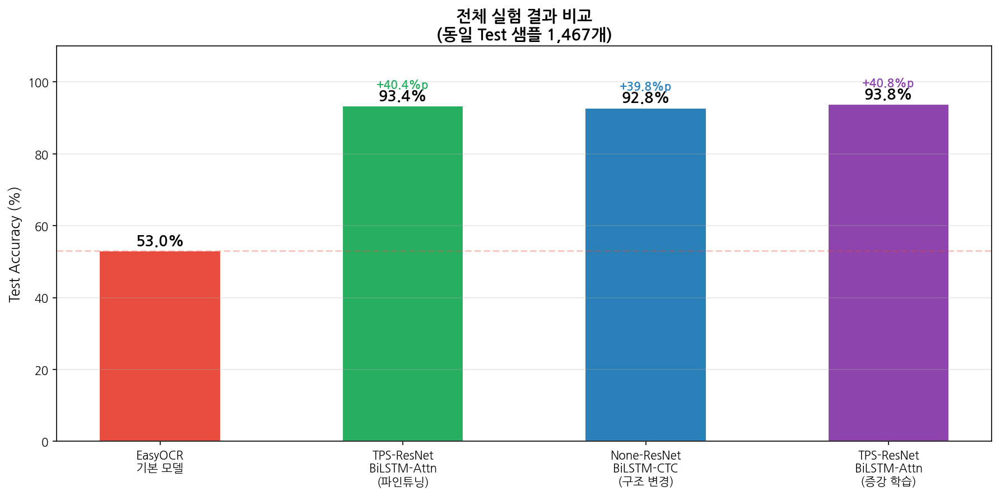
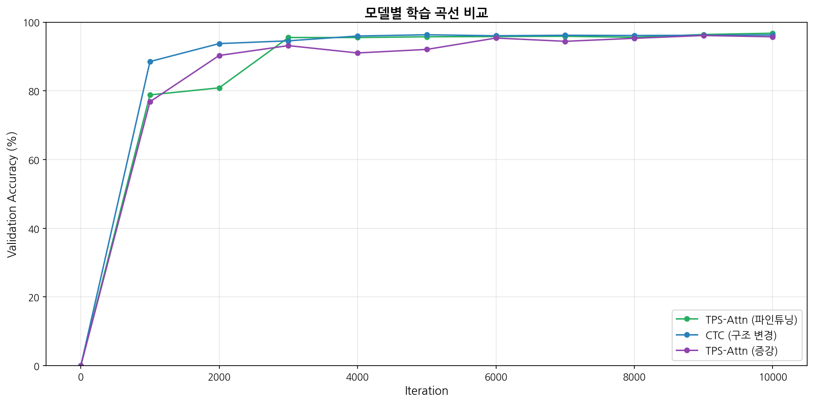
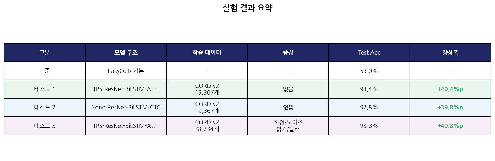

# Receipt OCR Classifier

영수증 이미지에서 텍스트를 인식하는 AI 시스템. EasyOCR을 CORD v2 데이터셋으로 파인튜닝하여 인식률을 대폭 향상시킨 프로젝트입니다.

## 주요 결과

| 구분 | 모델 구조 | 학습 데이터 | 증강 | Test Accuracy | 향상폭 |
|------|----------|------------|------|--------------|--------|
| 기준 | EasyOCR 기본 | - | - | 53.0% | - |
| 테스트 1 | TPS-ResNet-BiLSTM-Attn | CORD v2 19,367개 | 없음 | 93.4% | **+40.4%p** |
| 테스트 2 | None-ResNet-BiLSTM-CTC | CORD v2 19,367개 | 없음 | 92.8% | +39.8%p |
| 테스트 3 | TPS-ResNet-BiLSTM-Attn | CORD v2 38,734개 | 회전/노이즈/밝기/블러 | 93.8% | **+40.8%p** |

## 프로젝트 개요

범용 OCR 모델은 영수증 특유의 폰트, 레이아웃, 약어(svc, qty 등)에 최적화되어 있지 않아 인식률이 낮습니다. CORD v2 영수증 데이터셋으로 Transfer Learning을 적용하여 영수증 도메인 특화 OCR 모델을 개발했습니다.

## 파이프라인
영수증 이미지

→ 이미지 품질 보정 (CLAHE + 적응형 이진화)

→ OCR 텍스트 추출 (Fine-tuned EasyOCR)

→ 항목 파싱 (줄 그룹핑 + 금액 추출)

→ Few-shot 카테고리 분류 (ko-sroberta)

→ 소비 패턴 분석 + 시각화

## 모델 구조 (TPS-ResNet-BiLSTM-Attn)
입력 이미지 (100×32)

→ TPS  : Thin Plate Spline - 왜곡 보정

→ ResNet : Feature Extraction - CNN 기반 특징 추출

→ BiLSTM : Sequence Modeling - 양방향 문맥 파악

→ Attention : Prediction - 문자별 확률 예측

→ 텍스트 출력
## 데이터셋: CORD v2

| 분할 | 장수 | 단어 수 | 용도 |
|------|------|---------|------|
| Train | 800장 | 19,367개 | 모델 학습 |
| Validation | 100장 | 2,186개 | 학습 중 검증 |
| Test | 100장 | 2,356개 | 최종 성능 평가 |

- 출처: 네이버 클로바 (Naver Clova AI)
- HuggingFace: https://huggingface.co/datasets/naver-clova-ix/cord-v2

## 실험 결과

### 전체 비교


### 학습 곡선 비교


### 실험 요약 표


### 샘플 비교 (Base vs Fine-tuned)


## 학습 파라미터
batch_size  : 64

num_iter    : 10,000

optimizer   : Adadelta

lr          : 1.0

imgH        : 32

imgW        : 100

workers     : 4
## 환경

- Python 3.10
- PyTorch (CUDA 12.1)
- EasyOCR
- OpenCV
- sentence-transformers (ko-sroberta-multitask)
- WSL2 + Ubuntu 22.04
- NVIDIA RTX 4080

## 설치

```bash
conda create -n receipt python=3.10 -y
conda activate receipt
pip install torch torchvision --index-url https://download.pytorch.org/whl/cu121
pip install easyocr datasets sentence-transformers opencv-python-headless gradio pandas plotly Pillow lmdb
```

## 파일 구조
receipt-classifier/

├── src/

│   ├── preprocess.py              # 이미지 품질 보정

│   ├── ocr.py                     # OCR 파이프라인

│   ├── parser.py                  # 텍스트 파싱

│   ├── classifier.py              # Few-shot 분류기

│   ├── cord_to_lmdb.py            # 데이터셋 변환 (기본)

│   ├── cord_to_lmdb_augmented.py  # 데이터셋 변환 (증강)

│   ├── eval_easyocr.py            # EasyOCR 기본 모델 평가

│   ├── compare_models.py          # 모델 성능 비교

│   └── visualize_results2.py      # 시각화

├── train/

│   ├── train.py                   # 학습 코드

│   ├── dataset.py                 # 데이터 로더

│   ├── model.py                   # 모델 구조

│   └── utils.py                   # 유틸리티

├── logs/

│   ├── log_train.txt              # 테스트 1 학습 로그

│   ├── log_train_ctc.txt          # 테스트 2 학습 로그

│   └── log_train_augmented.txt    # 테스트 3 학습 로그

├── results/

│   ├── all_results.png            # 전체 실험 결과 비교

│   ├── training_curves_comparison.png  # 학습 곡선 비교

│   ├── summary_table.png          # 실험 요약 표

│   ├── training_curve.png         # 테스트 1 학습 곡선

│   ├── final_comparison.png       # 파인튜닝 전/후 비교

│   └── comparison.png             # 샘플 비교

└── README.md
## References

- Seunghyun Park et al., "CORD: A Consolidated Receipt Dataset for Post-OCR Parsing", NeurIPS 2019 Workshop
  - https://huggingface.co/datasets/naver-clova-ix/cord-v2

- Jeonghun Baek et al., "What Is Wrong With Scene Text Recognition Model Comparisons? Dataset and Model Analysis", ICCV 2019
  - https://github.com/clovaai/deep-text-recognition-benchmark

## Computer Vision 수업 프로젝트
- 사용 라이브러리: PyTorch (deep-text-recognition-benchmark 프레임워크)
