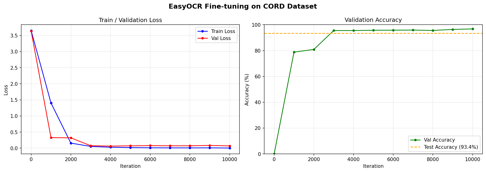
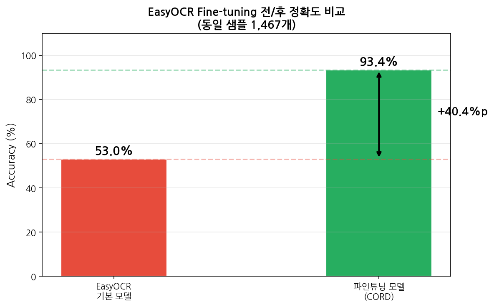

# Receipt OCR Classifier

영수증 이미지에서 텍스트를 인식하고 소비 항목을 분류하는 AI 시스템

## 프로젝트 개요

기본 EasyOCR 모델을 영수증 도메인 데이터(CORD v2)로 파인튜닝하여 인식률을 대폭 향상시킨 프로젝트입니다.

## 주요 결과

| 모델 | 정확도 |
|------|--------|
| EasyOCR 기본 모델 | 53.0% |
| 파인튜닝 모델 (CORD v2) | **93.4%** |
| 향상폭 | **+40.4%p** |

## 파이프라인
영수증 이미지
→ 이미지 품질 보정 (CLAHE + 적응형 이진화)
→ OCR 텍스트 추출 (Fine-tuned EasyOCR)
→ 항목 파싱 (줄 그룹핑 + 금액 추출)
→ Few-shot 카테고리 분류 (ko-sroberta)
→ 소비 패턴 분석 + 시각화
## 모델 구조 (TPS-ResNet-BiLSTM-Attn)
입력 이미지
→ TPS (왜곡 보정)
→ ResNet (특징 추출)
→ BiLSTM (시퀀스 모델링)
→ Attention (텍스트 예측)
## 학습 결과

- 학습 데이터: CORD v2 Train 19,367개 단어
- 검증 데이터: CORD v2 Val 2,186개 단어
- 테스트 데이터: CORD v2 Test 1,467개 단어
- 학습 iterations: 10,000
- 최종 Val Accuracy: 96.8%
- 최종 Test Accuracy: 93.4%

## 데이터셋

[CORD v2](https://huggingface.co/datasets/naver-clova-ix/cord-v2) - 네이버 클로바에서 공개한 영수증 OCR 데이터셋 (1,000장)

## 환경

- Python 3.10
- PyTorch (CUDA 12.1)
- EasyOCR
- OpenCV
- sentence-transformers (ko-sroberta-multitask)

## 설치

```bash
conda create -n receipt python=3.10 -y
conda activate receipt
pip install torch torchvision --index-url https://download.pytorch.org/whl/cu121
pip install easyocr datasets sentence-transformers opencv-python-headless gradio pandas plotly Pillow
```

## 파일 구조
```
receipt-classifier/
├── src/
│   ├── preprocess.py
│   ├── crop_receipt.py
│   ├── ocr.py
│   ├── parser.py
│   ├── classifier.py
│   ├── active_learning.py
│   ├── analyzer.py
│   ├── cord_to_lmdb.py
│   ├── eval_easyocr.py
│   ├── compare_models.py
│   └── visualize_results.py
├── train/
│   ├── train.py             ← 학습 코드
│   ├── dataset.py           ← 데이터 로더
│   ├── model.py             ← 모델 구조
│   └── utils.py             ← 유틸리티
├── logs/
│   └── log_train.txt        ← 학습 로그
├── results/
│   ├── training_curve.png
│   ├── final_comparison.png
│   └── comparison.png
└── README.md
```

## 실험 결과

### 학습 곡선


### 전/후 비교


### 샘플 비교


## Computer Vision 수업 프로젝트
- 인하공업전문대학
- 사용 라이브러리: PyTorch
